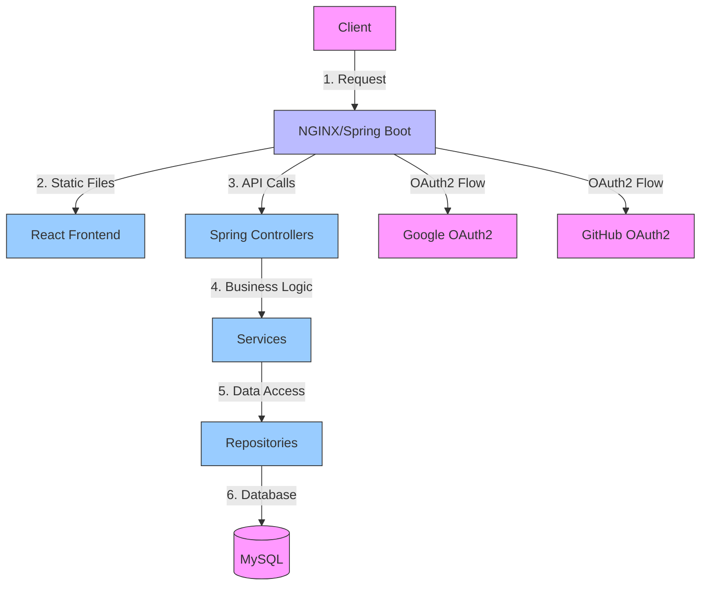
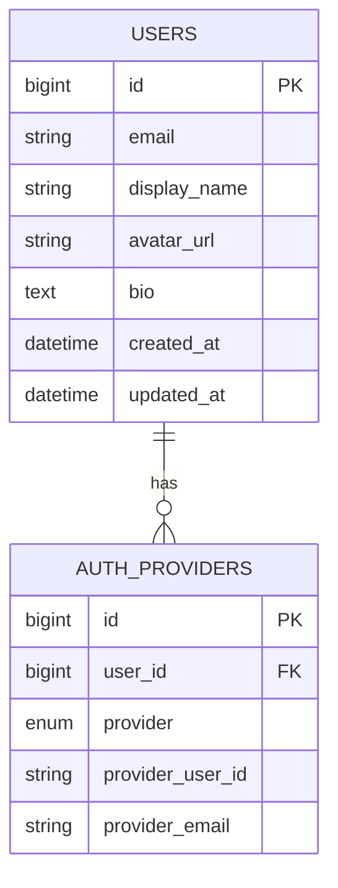

# OAuth2 Demo Application

A Spring Boot application demonstrating OAuth2 authentication with Google and GitHub, featuring a React frontend.

## Features

- OAuth2 login with Google and GitHub
- User profile management
- Session-based authentication
- Responsive design
- CSRF protection
- Database persistence

## Prerequisites

- Java 17+
- Maven 3.6+
- Node.js 16+
- MySQL 8.0+
- Google OAuth2 credentials
- GitHub OAuth2 credentials

## Setup

1. **Database Setup**
   - Create a MySQL database named `oauth2_demo`
   - Update database credentials in `application.properties`

2. **OAuth2 Setup**
   - Create OAuth2 applications with Google and GitHub
   - Configure authorized redirect URIs:
     - Google: `http://localhost:8080/login/oauth2/code/google`
     - GitHub: `http://localhost:8080/login/oauth2/code/github`
   - Update `application.properties` with your client IDs and secrets

3. **Environment Variables**
   ```properties
   # Google OAuth2
   spring.security.oauth2.client.registration.google.client-id=your-client-id
   spring.security.oauth2.client.registration.google.client-secret=your-client-secret
   
   # GitHub OAuth2
   spring.security.oauth2.client.registration.github.client-id=your-client-id
   spring.security.oauth2.client.registration.github.client-secret=your-client-secret
   ```

## Running the Application

1. **Backend**
   ```bash
   mvn spring-boot:run
   ```

2. **Frontend (Development)**
   ```bash
   cd src/main/frontend
   npm install
   npm start
   ```

3. **Access the Application**
   - Open `http://localhost:3000` for development
   - Open `http://localhost:8080` for production build

## Architecture

### System Architecture



### Database Schema



## Project Structure

```
src/
├── main/
│   ├── java/com/example/oauth2demo/
│   │   ├── config/         # Configuration classes
│   │   ├── controller/     # REST controllers
│   │   ├── model/          # JPA entities
│   │   ├── repository/     # Data access layer
│   │   ├── security/       # Security configuration
│   │   └── service/        # Business logic
│   └── resources/
│       └── static/         # Frontend build output
└── test/                   # Test files
```

## API Endpoints

| Method | Endpoint          | Description                     |
|--------|-------------------|---------------------------------|
| GET    | /                 | Home page with login options    |
| GET    | /profile          | User profile page               |
| POST   | /profile          | Update profile                  |
| GET    | /logout           | Logout user                     |

## Security

- CSRF protection with Cookie-based token storage
- Session management with maximum 1 session per user
- Secure cookie settings
- Password hashing with BCrypt

## Error Handling

- Global exception handling
- Custom error pages
- Input validation

## Testing

```bash
# Run all tests
mvn test

# Run specific test
mvn test -Dtest=UserServiceTest
```

## Deployment

1. Build the application:
   ```bash
   mvn clean package
   ```

2. Run the JAR file:
   ```bash
   java -jar target/oauth2-demo-0.0.1-SNAPSHOT.jar
   ```

## Contributing

1. Fork the repository
2. Create a feature branch
3. Commit your changes
4. Push to the branch
5. Create a Pull Request

## License

This project is licensed under the MIT License - see the [LICENSE](LICENSE) file for details.
